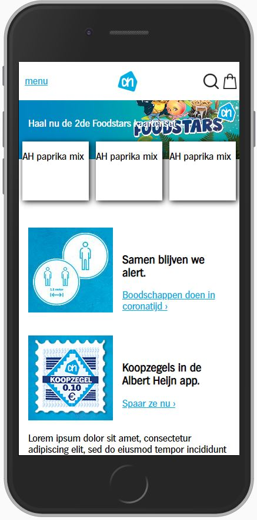

# Procesverslag
**Auteur:** Joost Flick

## Bronnenlijst
1. https://css-tricks.com/creating-responsive-touch-friendly-carousels-with-flickity/
2. https://www.w3schools.com/howto/howto_css_dropdown.asp
3. https://stackoverflow.com/questions/40446658/javascript-add-transition-between-displaynone-and-displayblock

## Intake (week 1)

**Je startniveau:** De rode piste

**Je focus:** Helemaal responsive maken

**Je opdracht:** www.ah.nl

**Screenshot:**

## Voortgang 1 (week 3)

### Stand van zaken

Goed: Opzet, sticky header

Lastig: Producten carousel voor mobiel

https://www.w3schools.com/tags/tag_figure.asp

**Screenshot(s):**

#### Vergelijking origineel en mijn replica

##### Origineel

##### Mijn versie

### Verslag van meeting

- cards 3 naast elkaar stylen ipv caroussel
- minder divs gebruiken
- focussen op responsiveness
- kijken waar padding/margin gebruiken

## Voortgang 2 (week 5)

Header + content responsive gemaakt.
Op de screenshots hieronder is te zien hoe de content meeschaalt met de schermgrootte.

##### Mobiel

##### Desktop

### Verslag van meeting
Feedback van Victor

- product cards uitbreiden
- h1 toevoegen
- rekening houden met widescreens

## Voortgang 3 (week 6)

- Breedte aangepast zodat de site niet te breed wordt op widescreens
- h1 met visibility hidden toegevoegd (https://stackoverflow.com/questions/3239202/whats-the-correct-way-to-hide-the-h1-tag-and-not-be-banned-from-google)
- product kaarten uitgebreid
- adblocker banners gemaakt
- uitgelichte producten flex direction column voor mobiel
- footer toegevoegd
- product pagina toegevoegd
- dropdown menu + animatie toegevoegd

##### Mobiel

##### Widescreen

## Eindgesprek (week 7/8)

**Screenshot(s):**
##### Desktop

##### Mobiel

